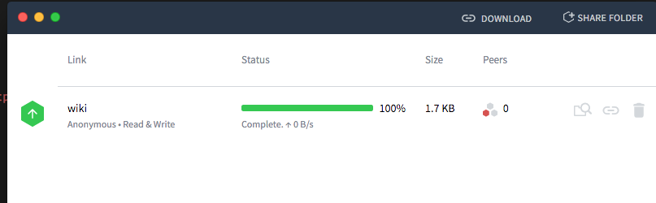
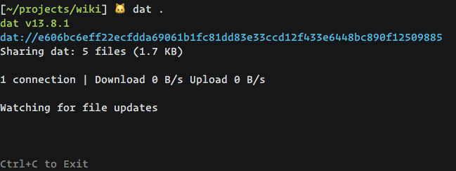

# civic-notebook

Analyze civic data with [jupyter notebook](https://jupyter.org/) from decentralized data source.

## Prerequisite

#### Docker

1. Make sure you have `docker` installed and `docker` exists in your shell path.
2. `docker pull jupyter/datascience-notebook`

## Usage

#### Sharing Data

Use [Dat](datproject.org)'s GUI application.



You can also use [CLI interface](https://github.com/datproject/dat):



For hosting your data on a server, try [hypercored](https://github.com/mafintosh/hypercored).


#### Using Data

```
$ git clone git@github.com:poga/civic-notebook.git
$ cd civic-notebook
$ npm i
$ npm run dev

// open http://localhost:8080
```

## License

The MIT License
